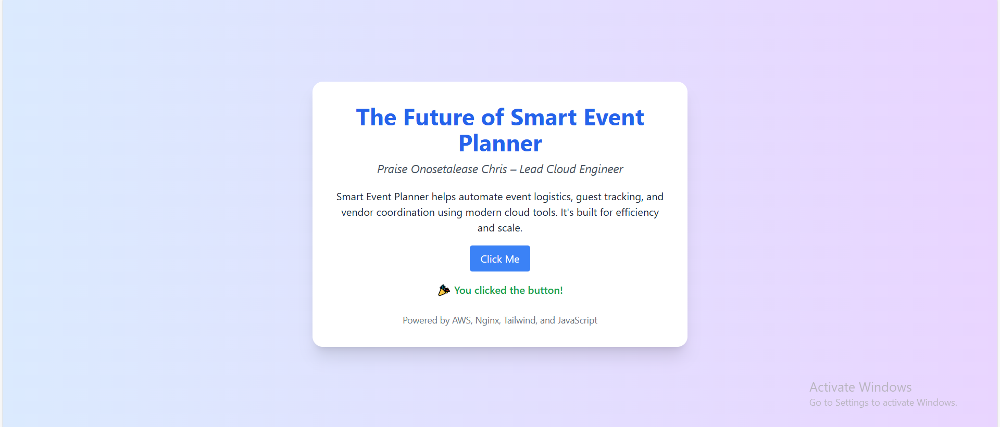

# Smart Event Planner

**Hosted at:** [http://34.238.51.99](http://34.238.51.99)

## 🔥 Project Title
**The Future of Smart Event Planning**

## 👋 Author
**Praise Onosetalease – Lead Cloud Engineer**

## 🧠 Project Pitch

Smart Event Planner is a cloud-based platform that simplifies event planning with modern tools and automation. From RSVPs to vendor coordination, our system saves time and ensures smooth event experiences. It's designed to impress both users and investors with its sleek interface and smart features.

## 🧑‍💻 Professional Bio

I'm a student at AltSchool of Engineering, passionate about DevOps and cloud technologies. My skills include HTML, CSS, JavaScript, Linux, Git, and AWS. I enjoy building scalable solutions that solve real-world problems and demonstrate technical excellence.

## ✅ Features

- Responsive landing page with personalized content
- Nginx web server hosted on AWS EC2 (Ubuntu)
- JavaScript interactivity
- Tailwind CSS styling and animations
- HTTPS (Let’s Encrypt SSL via Certbot)
- Public IP access

## 🌍 Deployment

This web application is deployed on an Ubuntu EC2 instance using:

- AWS EC2 (Ubuntu)
- Nginx as the web server
- TailwindCSS for styling
- Git & GitHub for version control
- Let's Encrypt SSL for HTTPS (optional enhancement)

## 🧭 How to Access

To view the deployed landing page, visit:

👉 [http://34.238.51.99](http://34.238.51.99)

## 📸 Screenshot

## 📂 Folder Contents

smart-event-planner/
├── index.html         # Landing page
├── README.md          # Project documentation
└── screenshot.png     # Screenshot of the live page
